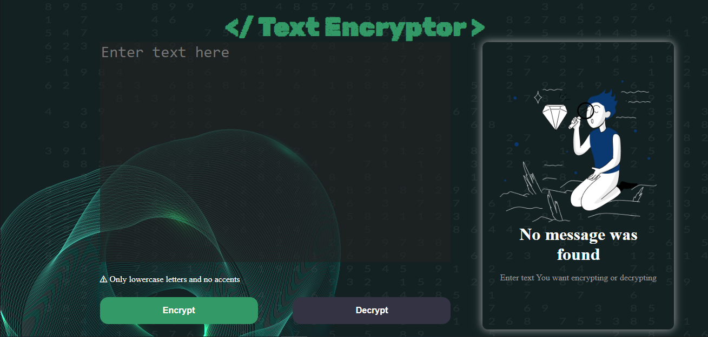
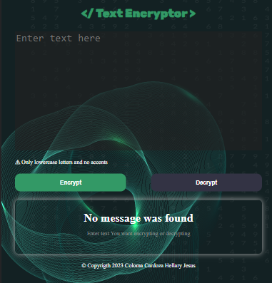
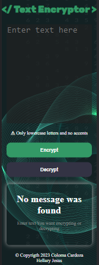

# Text Encryptor 
Alura challenge of Program ONE - Oracle Next Education
  

> ## **Description** 
This is a page web where We can encrypt messages and to decrypt too, It was developed with Html , CSS and Javascript.

:arrow_right: Challenge rules 
* It must work only with lowercase letters
* Don't use letters with accents nither special characters
* Must to be posible to convert a word to the encrypt version, also return a encrypt word to its original version.
*The web page must have fields to enter text and can choose between the options `Encrypt` and `Decrypt`
*Must to be a button to copy the output text like the commad ctrl+c 

:arrow_right: Keys

| Letter | Key  |
|:------:|:----:|
| a      | ai   |
| e      | enter|
| i      | imes |
| o      | ober |
| u      | ufat |

  

> ## **Visuals**
:desktop_computer: `Computer`

:computer: `Tablet`

:iphone: `Movil`

  

> ## **Link**
* [Challenge Text Ecryptor :globe_with_meridians:](https://jesus-colomacardoza.github.io/challengeAluraTextEncryptor/)
  

> ## **Roadmap**
* [v0.1.0](https://github.com/Jesus-ColomaCardoza/challengeAluraTextEncryptor/tags)
  

> ## **Author**
* Hellary Jesus Coloma Cardoza  :man_technologist:

